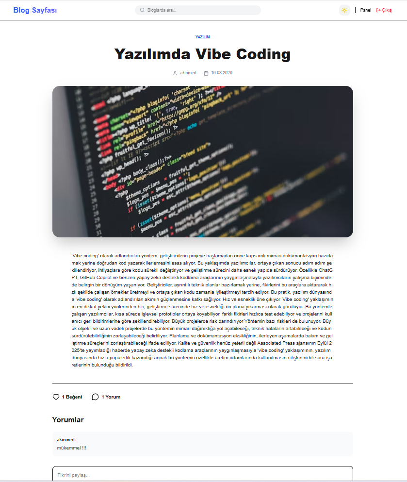
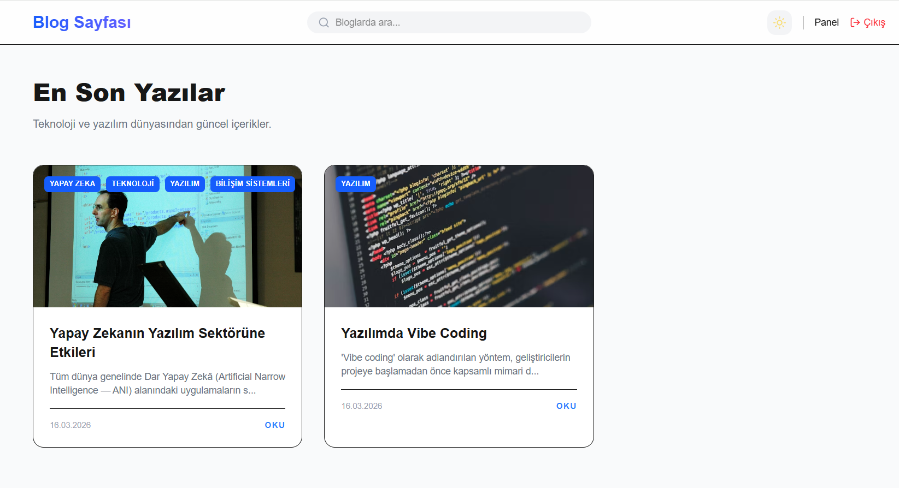

# Modern Blog Platformu (MERN Stack)

Bu proje, **MERN (MongoDB, Express.js, React/Next.js, Node.js)** yığını ile geliştirilmiş kapsamlı bir tam yığın (full-stack) blog uygulamasıdır. Karanlık/aydınlık mod desteği, kimlik doğrulama, admin paneli ve zengin metin düzenleme yeteneklerine sahip modern ve duyarlı bir arayüz sunar.

## 🌟 Temel Özellikler

### 🔐 Kimlik Doğrulama & Güvenlik
- **JWT Kimlik Doğrulama:** JSON Web Token kullanarak güvenli kullanıcı oturumları.
- **Rol Tabanlı Erişim Kontrolü:** 'Kullanıcı' (user) ve 'Yönetici' (admin) için ayrı yetkilendirme.
- **Korunan Rotalar:** `AdminGuard` bileşeni sayesinde admin paneline sadece yetkili kullanıcıların erişebilmesi.
- **Güvenli Şifreleme:** Kullanıcı şifreleri veritabanında saklanmadan önce bcrypt ile hashlenir.

### 📝 Blog Yönetimi (CRUD)
- **Oluştur & Düzenle:** Görsel destekli tam özellikli zengin metin editörü (React Quill).
- **Oku:** Duyarlı tasarıma sahip, estetik blog detay sayfaları.
- **Sil:** Yöneticiler içerikleri kolayca kaldırabilir.
- **Arama & Filtreleme:** Ana sayfada gerçek zamanlı arama fonksiyonu.
- **Kategoriler:** Yazıları dinamik kategorilerle organize etme imkanı.

### 💬 Etkileşim & Katılım
- **Yorumlar:** Kullanıcılar blog yazılarına yorum yapabilir.
- **Beğeniler:** Kullanıcılar yazıları beğenebilir/beğenmekten vazgeçebilir.
- **Görüntülenme Sayacı:** Her yazı için otomatik görüntülenme takibi.

### 🎨 Arayüz & Kullanıcı Deneyimi (UI/UX)
- **Karanlık/Aydınlık Mod:** Kullanıcı tercihini hatırlayan sorunsuz tema geçişi.
- **Duyarlı Tasarım:** Tailwind CSS ile mobil, tablet ve masaüstü için tam uyumlu tasarım.
- **Animasyonlar:** Framer Motion kullanılarak oluşturulan akıcı sayfa geçişleri ve bileşen animasyonları.
- **Yükleme Durumları:** Daha iyi bir performans algısı için iskelet (skeleton) yükleyiciler.

---

## 🛠 Teknoloji Yığını

### Ön Yüz (Client)
- **Framework:** [Next.js 14](https://nextjs.org/) (App Router yapısı)
- **Durum Yönetimi:** [Redux Toolkit](https://redux-toolkit.js.org/)
- **Stillendirme:** [Tailwind CSS](https://tailwindcss.com/)
- **Animasyonlar:** [Framer Motion](https://www.framer.com/motion/)
- **HTTP İstemcisi:** [Axios](https://axios-http.com/)
- **İkonlar:** [Lucide React](https://lucide.dev/)
- **Editör:** [React Quill](https://github.com/zenoamaro/react-quill)

### Arka Yüz (Server)
- **Çalışma Ortamı:** [Node.js](https://nodejs.org/)
- **Framework:** [Express.js](https://expressjs.com/)
- **Veritabanı:** [MongoDB](https://www.mongodb.com/) (Mongoose ODM ile)
- **Kimlik Doğrulama:** [JSON Web Token (JWT)](https://jwt.io/)
- **Güvenlik:** [Cors](https://www.npmjs.com/package/cors), [Dotenv](https://www.npmjs.com/package/dotenv)

---

## 📂 Proje Yapısı

```bash
blog-project/
├── client/                 # Ön Yüz Uygulaması (Next.js)
│   ├── src/
│   │   ├── app/           # App Router Sayfaları (Ana Sayfa, Admin, Blog Detay, Auth)
│   │   ├── components/    # Tekrar Kullanılabilir UI Bileşenleri (Navbar, BlogCard, ThemeToggle)
│   │   ├── lib/           # Redux Store & Slice'lar (Durum Yönetimi)
│   │   └── ...
│   └── ...
├── server/                 # Arka Yüz API (Node.js/Express)
│   ├── config/            # Veritabanı Bağlantısı
│   ├── controllers/       # Rota Mantığı (Auth, Blog, Kategori)
│   ├── middleware/        # Auth Middleware (Yetkilendirme Ara Yazılımı)
│   ├── models/            # Mongoose Şemaları (Kullanıcı, Blog, Kategori)
│   ├── routes/            # API Rotaları
│   └── server.js          # Giriş Noktası
└── README.md              # Proje Dokümantasyonu
```

---

## 🚀 Kurulum ve Başlangıç

### Gereksinimler
- Node.js (v18 veya üzeri önerilir)
- MongoDB (Yerel veya Atlas URI)

### 1. Arka Yüz Kurulumu (Server)

Server klasörüne gidin:
```bash
cd server
```

Bağımlılıkları yükleyin:
```bash
npm install
```

`server` klasöründe `.env` dosyası oluşturun ve değişkenlerinizi ekleyin:
```env
PORT=5000
MONGO_URI=mongodb_baglanti_adresiniz
JWT_SECRET=gizli_anahtariniz
```

Sunucuyu başlatın:
```bash
npm start
# veya geliştirme modu için (nodemon ile)
npm run dev
```
Sunucu `http://localhost:5000` adresinde çalışacaktır.

### 2. Ön Yüz Kurulumu (Client)

Yeni bir terminal açın ve client klasörüne gidin:
```bash
cd client
```

Bağımlılıkları yükleyin:
```bash
npm install
```

Next.js geliştirme sunucusunu başlatın:
```bash
npm run dev
```
Uygulama `http://localhost:3000` adresinde çalışacaktır.

---

## 🔌 API Uç Noktaları (Endpoints)

### Kimlik Doğrulama (Auth)
- `POST /api/auth/register` - Yeni kullanıcı kaydı
- `POST /api/auth/login` - Kullanıcı girişi & token alma

### Bloglar
- `GET /api/blogs` - Tüm blogları getir (arama sorgusu destekler)
- `GET /api/blogs/:id` - Tekil blog detayını getir
- `POST /api/blogs` - Yeni blog oluştur (Sadece Admin)
- `PUT /api/blogs/:id` - Blog güncelle (Sadece Admin)
- `DELETE /api/blogs/:id` - Blog sil (Sadece Admin)
- `POST /api/blogs/:id/like` - Blog beğen/beğenmekten vazgeç
- `POST /api/blogs/:id/comments` - Yorum ekle

### Kategoriler
- `GET /api/categories` - Tüm kategorileri getir
- `POST /api/categories` - Yeni kategori oluştur (Sadece Admin)

---

## 💡 Nasıl Çalışır? (Kod İncelemesi)

### 1. Durum Yönetimi (Redux)
Uygulama global durumu yönetmek için Redux Toolkit kullanır.
- **authSlice:** Kullanıcı oturumu, giriş, kayıt ve çıkış işlemlerini yönetir. Kullanıcı token'ını `localStorage` içinde saklar.
- **blogSlice:** Blogları getirme, arama, detay görüntüleme, beğenme ve yorum yapma işlemlerini yönetir.
- **categorySlice:** Kategorileri getirme ve oluşturma işlemlerini yönetir.

### 2. Kimlik Doğrulama Akışı
- Kullanıcı giriş yaptığında, arka yüz bilgileri doğrular ve bir **JWT** üretir.
- Ön yüz bu token'ı saklar ve sonraki her istekte `Authorization` başlığına ekler (Axios interceptor ile `client/src/lib/axios.js` dosyasında).
- `AdminGuard` bileşeni, kullanıcının rolünü kontrol ederek admin sayfalarına yetkisiz erişimi engeller.

### 3. Dinamik Yönlendirme
- Navigasyon için Next.js App Router kullanılır.
- `/blog/[id]` gibi sayfalar, URL'deki ID'ye göre dinamik içerik çeker.

### 4. Arama Fonksiyonu
- `Navbar` içindeki arama çubuğu URL sorgu parametresini günceller (`?search=terim`).
- `Home` sayfası bu parametreyi dinler ve `fetchBlogs` aksiyonunu arama terimiyle tetikler.
- Arka yüz, MongoDB sorgusunda regex kullanarak esnek eşleştirme yapar.

### 5. Tasarım & Temalar
- **Tailwind CSS**, tüm stillendirme işlemlerini utility sınıfları ile halleder.
- **Karanlık Mod**, `<html>` elementine `dark` sınıfı eklenip çıkarılarak yönetilir. Bu durum `ThemeToggle` bileşeni ile kontrol edilir ve `localStorage`'da saklanır.

## 📱 Ekran Görüntüleri


Developed by [Akın Mert AK](https://github.com/akinmertak)